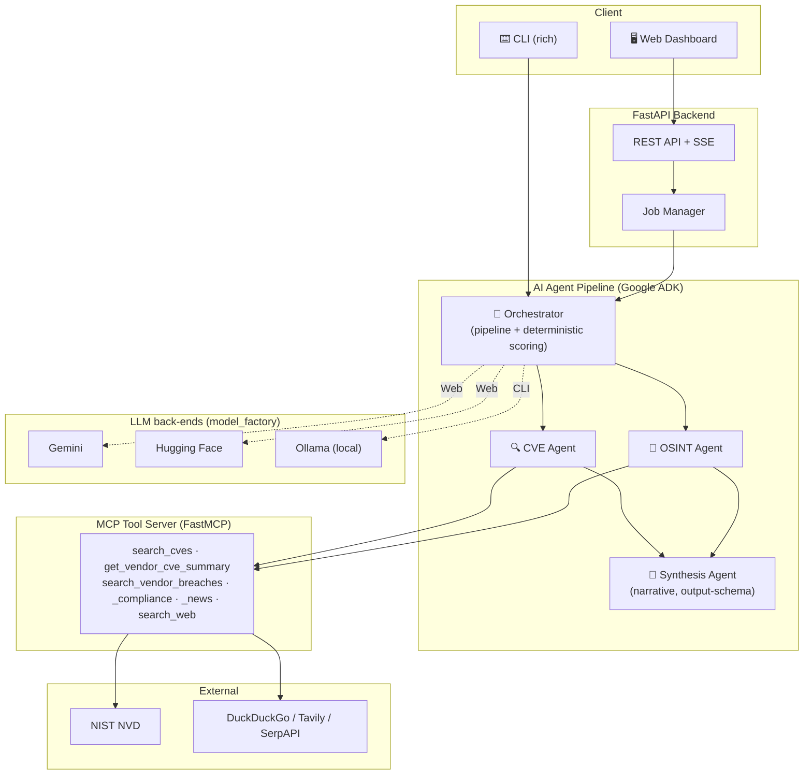

# 🛡️ Automated Vendor Risk Assessor

[](https://python.org)
[](https://fastapi.tiangolo.com)
[](https://google.github.io/adk-docs/)
[](https://www.kaggle.com/)
[](LICENSE)

> **AI-powered vendor cybersecurity risk assessment platform** — Evaluate third-party vendors using autonomous AI agents that research vulnerabilities, analyze breach history, and generate comprehensive, quantified risk reports. Built for the Kaggle Agentic AI Competition.

---

## 🏗️ Architecture

A **hierarchical multi-agent pipeline** on the Google Agent Development Kit (ADK): two research agents run in parallel and feed a narrative synthesis agent. All external capabilities are exposed through a **Model Context Protocol (MCP)** tool server. The **risk score is computed deterministically in Python** — the LLM only writes prose.



---

## 🧠 Model back-ends (the important bit)

The **same agent pipeline** runs on interchangeable LLM back-ends, selected **per entry-point** by `agents/model_factory.py`. Gemini names resolve natively in ADK; everything else (`ollama_chat/*`, `huggingface/*`, `openai/*`) is wrapped in **LiteLLM**.

| Entry-point | Env var | Typical value | Needs |
|---|---|---|---|
| **CLI** | `AGENT_MODEL` | `ollama_chat/llama3.1` | Ollama running locally (no API key) |
| **Web** | `WEB_AGENT_MODEL` | `huggingface/Qwen/Qwen2.5-7B-Instruct` | `HUGGINGFACE_API_KEY` |
| **Web (alt)** | `WEB_AGENT_MODEL` | `gemini-2.0-flash-lite` | `GOOGLE_API_KEY` (+ quota) |
| **Web (alt)** | `WEB_AGENT_MODEL` | `ollama_chat/llama3.1` | Ollama on the host (fully local) |

> **Why the split?** The CLI stays fully local (privacy, zero cost). The web dashboard is deployed, so it uses a hosted model — **Hugging Face (Qwen2.5-7B-Instruct)** is the default because it needs no local runtime and no Gemini quota. Pick whichever back-end you have credentials for; the agent code is identical.

Reports are **scored deterministically regardless of model**, so even a weak model still produces a complete, correct report (the narrative falls back to a template if the model can't emit clean JSON).

---

## ✨ Features

| Feature | Description |
|---------|-------------|
| 🤖 **Multi-Agent Pipeline** | Parallel CVE + OSINT research agents feeding a narrative synthesis agent (Google ADK) |
| 🔌 **MCP Tool Integration** | FastMCP server exposes NVD & web-search tools over stdio **and** SSE |
| 🔀 **Pluggable LLMs** | Gemini, Hugging Face, or fully-local Ollama — swapped via one env var |
| 🧮 **Deterministic Scoring** | Weighted, auditable 0–100 risk score computed in Python, never by the LLM |
| 🧷 **Structured Output** | Synthesis constrained to a JSON schema so even small local models stay parseable |
| 📡 **Real-time Streaming** | Server-Sent Events push live per-vendor progress to the dashboard |
| 🩺 **Health Checks** | `cli.py doctor` + `/api/status` verify LLM, NVD, and search connectivity |
| 📤 **Exports** | Download any assessment as JSON or Markdown (CLI `--output` or API) |
| ⌨️ **Polished CLI** | `rich`-powered panels, risk bars, live progress, and a batch comparison table |
| 🐳 **Docker Ready** | Single self-contained container; Cloud Run–ready |
| 🔒 **Security First** | No secrets in code, tamper-resistant scoring, non-root container, graceful degradation |

---

## 🚀 Quick Start

### 1. Clone & Install

```bash
git clone https://github.com/your-org/vendor-risk-assessor.git
cd vendor-risk-assessor

python -m venv venv
# Windows
venv\Scripts\activate
# macOS / Linux
source venv/bin/activate

pip install -r requirements.txt
```

### 2. Configure Environment

```bash
cp .env.example .env
# Edit .env — set the model(s) and matching key(s) you want
```

| Variable | Required | Description |
|----------|----------|-------------|
| `AGENT_MODEL` | ⬜ | LLM for the **CLI**. Default `ollama_chat/llama3.1` (local Ollama). |
| `WEB_AGENT_MODEL` | ⬜ | LLM for the **web dashboard**. Default `huggingface/Qwen/Qwen2.5-7B-Instruct`. |
| `HUGGINGFACE_API_KEY` | ⬜ | Needed when `WEB_AGENT_MODEL` is a `huggingface/*` model. |
| `GOOGLE_API_KEY` | ⬜ | Needed when a model is `gemini-*`. |
| `OLLAMA_BASE_URL` | ⬜ | Ollama server URL (default `http://localhost:11434`). |
| `NVD_API_KEY` | ⬜ | NVD key (free; increases rate limits). |
| `SEARCH_PROVIDER` | ⬜ | `duckduckgo` (default), `tavily`, or `serpapi`. |
| `SEARCH_API_KEY` | ⬜ | Required only for Tavily / SerpAPI. |
| `PORT` | ⬜ | Web server port (default `8000` locally; `8080` in Docker). |

### 3. Run

```bash
# Web dashboard  →  http://localhost:8000
python run.py

# CLI assessment (local Ollama)
python cli.py assess "Microsoft" "Okta" "Salesforce"

# Verify your setup (LLM / NVD / search connectivity)
python cli.py doctor
```

**Windows:** `start.bat` gives a menu — Web (HF/Gemini), Web (Ollama), CLI, Test, and Doctor.

---

## ⚙️ Configuration

All configuration is via environment variables (`.env` file or system env):

```ini
# ── Models (per entry-point) ────────────────────────────────
AGENT_MODEL=ollama_chat/llama3.1                    # CLI  → local Ollama
WEB_AGENT_MODEL=huggingface/Qwen/Qwen2.5-7B-Instruct # Web → Hugging Face
# alternatives for WEB_AGENT_MODEL:
#   gemini-2.0-flash-lite        (needs GOOGLE_API_KEY)
#   ollama_chat/llama3.1         (fully local)

# ── Keys (only what your chosen models need) ────────────────
HUGGINGFACE_API_KEY=hf_xxx        # for huggingface/* models
GOOGLE_API_KEY=your-gemini-key    # for gemini-* models
OLLAMA_BASE_URL=http://localhost:11434
NVD_API_KEY=your-nvd-key
SEARCH_PROVIDER=duckduckgo

# ── Server ──────────────────────────────────────────────────
HOST=0.0.0.0
PORT=8000
DEBUG=false

# ── MCP tool server ─────────────────────────────────────────
MCP_TRANSPORT=stdio               # stdio (auto-managed) or sse (external)
MCP_SERVER_PORT=8081
```

### 🦙 Using Ollama (local, no API key)

1. **Install Ollama** from [ollama.com](https://ollama.com/) and start it.
2. **Pull a model** (8B+ with good tool-calling recommended):
   ```bash
   ollama pull llama3.1        # or: qwen2.5, mistral
   ```
3. **Set your `.env`** (works for CLI, or the web too):
   ```ini
   AGENT_MODEL=ollama_chat/llama3.1        # CLI
   WEB_AGENT_MODEL=ollama_chat/llama3.1    # optional: web on local Ollama
   ```
   > Use the `ollama_chat/` prefix — it gives better tool-calling and JSON than `ollama/`.

### 🤗 Using Hugging Face (hosted, for deployment)

1. Create a token at [huggingface.co/settings/tokens](https://huggingface.co/settings/tokens) (Read scope).
2. Set:
   ```ini
   WEB_AGENT_MODEL=huggingface/Qwen/Qwen2.5-7B-Instruct
   HUGGINGFACE_API_KEY=hf_xxxxxxxx
   ```
   Use an **`-Instruct`/chat** model — the research agents need tool-calling.

---

## 🐳 Docker Deployment

The image serves the **web dashboard**; the MCP tool server runs in-process over stdio, so it's a single self-contained container.

### Docker Compose

```bash
docker compose up --build     # starts the app on http://localhost:8080
docker compose down
```

> Provide your model + keys in `.env` (loaded via `env_file`). The container standardises on port `8080` and `MCP_TRANSPORT=stdio`.

### Standalone Docker

```bash
docker build -t vendor-risk-assessor .
docker run -p 8080:8080 --env-file .env vendor-risk-assessor
```

---

## ☁️ Cloud Run Deployment

```bash
gcloud builds submit --tag gcr.io/YOUR_PROJECT/vendor-risk-assessor

gcloud run deploy vendor-risk-assessor \
  --image gcr.io/YOUR_PROJECT/vendor-risk-assessor \
  --platform managed \
  --region us-central1 \
  --allow-unauthenticated \
  --set-env-vars "WEB_AGENT_MODEL=huggingface/Qwen/Qwen2.5-7B-Instruct,HUGGINGFACE_API_KEY=...,NVD_API_KEY=..." \
  --port 8080 \
  --memory 1Gi \
  --timeout 300
```

> Set secrets as environment variables / secrets in your platform — never bake them into the image (`.env` is git- and docker-ignored).

---

## 📡 API Documentation

Interactive docs (local): **Swagger** [http://localhost:8000/docs](http://localhost:8000/docs) · **ReDoc** [http://localhost:8000/redoc](http://localhost:8000/redoc)

| Method | Path | Description |
|--------|------|-------------|
| `GET` | `/` | Web dashboard |
| `POST` | `/api/assess` | Start a new assessment job |
| `GET` | `/api/assess/{job_id}` | Get job status & results |
| `GET` | `/api/assess/{job_id}/stream` | SSE progress event stream |
| `GET` | `/api/assess/{job_id}/export?format=json\|md` | Download report as JSON / Markdown |
| `GET` | `/api/health` | Liveness check |
| `GET` | `/api/status` | Component status (LLM / NVD / search) |

### Example: Start Assessment

```bash
curl -X POST http://localhost:8000/api/assess \
  -H "Content-Type: application/json" \
  -d '{"vendors": ["Microsoft", "Salesforce", "Okta"]}'
```

**Response:**
```json
{ "job_id": "a1b2c3d4e5f6...", "status": "started" }
```

### Example: Stream Events

```bash
curl -N http://localhost:8000/api/assess/a1b2c3d4e5f6.../stream
```

```
data: {"type": "progress", "message": "Orchestrator ready. Assessing 3 vendor(s)…"}
data: {"type": "agent_activity", "vendor": "Microsoft", "message": "CVE analysis in progress"}
data: {"type": "result", "vendor": "Microsoft", "message": "Assessment complete", "data": {...}}
data: {"type": "complete", "message": "All vendor assessments completed.", "data": {"total_vendors": 3}}
```

---

## ⌨️ CLI Usage

```bash
# Assess multiple vendors
python cli.py assess "Vendor A" "Vendor B" "Vendor C"

# Save the report
python cli.py assess "Vendor A" --output report.md      # or report.json
python cli.py assess "Vendor A" --json                  # raw JSON to stdout

# Disable colour (for piping / CI)
python cli.py assess "Vendor A" --no-color

# Health check + help
python cli.py doctor
python cli.py --help
```

**Example output:**

```
  ACME CORP
────────────────────────────────────────────────────────────────────────
  Risk Level : 🟡  MEDIUM
  Risk Score : [████████████░░░░░░░░] 62.0/100
════════════════════════════════════════════════════════════════════════
  VENDOR                         RISK LEVEL      SCORE
────────────────────────────────────────────────────────────────────────
  Acme Corp                      🟡 MEDIUM       62.0/100
  Globex                         🟢 LOW          31.0/100
════════════════════════════════════════════════════════════════════════
```

---

## 📁 Project Structure

```
vendor-risk-assessor/
├── agents/                   # AI agent pipeline (Google ADK)
│   ├── orchestrator.py       # Pipeline wiring + deterministic scoring & merge
│   ├── cve_agent.py          # CVE / vulnerability research agent
│   ├── osint_agent.py        # OSINT (breaches, compliance, incidents) agent
│   ├── synthesis_agent.py    # Narrative agent (JSON output-schema, no tools)
│   ├── scoring.py            # Deterministic weighted risk-scoring engine
│   ├── model_factory.py      # Routes model names → Gemini / LiteLLM (HF, Ollama…)
│   └── preflight.py          # Health checks (doctor / /api/status)
├── mcp_server/               # MCP tool server
│   ├── server.py             # FastMCP entry point (stdio / sse)
│   ├── nvd_client.py         # NIST NVD client
│   └── web_search_client.py  # DuckDuckGo / Tavily / SerpAPI client
├── app/                      # FastAPI web application
│   ├── main.py               # Routes, SSE, /api/status, export
│   ├── exporters.py          # JSON / Markdown report exporters
│   ├── static/               # CSS, JS
│   └── templates/index.html  # Dashboard
├── cli.py                    # rich CLI (assess / doctor)
├── run.py                    # Web entry point (spawns MCP, runs Uvicorn)
├── start.bat                 # Windows launcher menu
├── requirements.txt
├── Dockerfile
├── docker-compose.yml
└── README.md
```

---

## 🧰 Tech Stack

| Layer | Technology |
|-------|-----------:|
| **AI Agents** | [Google Agent Development Kit (ADK)](https://google.github.io/adk-docs/) |
| **LLMs** | [Hugging Face](https://huggingface.co/) · Google Gemini 2.0 · [Ollama](https://ollama.com/) — via [LiteLLM](https://docs.litellm.ai/) |
| **Tool Protocol** | [Model Context Protocol (MCP / FastMCP)](https://modelcontextprotocol.io/) |
| **Web Framework** | [FastAPI](https://fastapi.tiangolo.com/) + Uvicorn + SSE |
| **CLI** | [rich](https://rich.readthedocs.io/) |
| **Vulnerability DB** | [NIST NVD API](https://nvd.nist.gov/) |
| **Search** | DuckDuckGo / Tavily / SerpAPI |
| **Containerisation** | Docker + Docker Compose |
| **Cloud** | Google Cloud Run |

---

## 📄 License

This project is licensed under the **MIT License** — see the [LICENSE](LICENSE) file for details.

---

<p align="center">
  Built with ❤️ using Google ADK, FastAPI, and MCP
</p>
