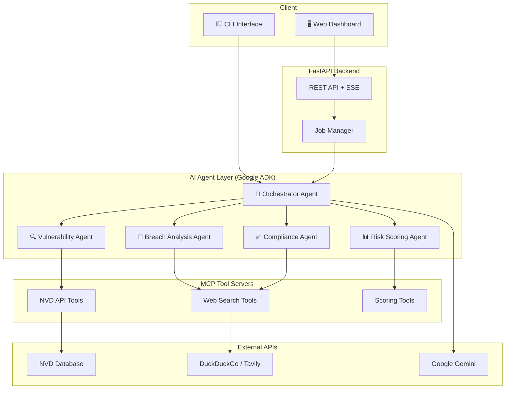

# 🛡️ Automated Vendor Risk Assessor

[](https://python.org)
[](https://fastapi.tiangolo.com)
[](https://google.github.io/adk-docs/)
[](https://www.kaggle.com/)
[](LICENSE)

> **AI-powered vendor cybersecurity risk assessment platform** — Evaluate third-party vendors using autonomous AI agents that research vulnerabilities, analyze breach history, and generate comprehensive risk reports. Originally built for the Kaggle Agentic AI Competition.

---

## 🏗️ Architecture



---

## ✨ Features

| Feature | Description |
|---------|-------------|
| 🤖 **Multi-Agent Architecture** | Specialized AI agents for vulnerability, breach, compliance, and risk analysis |
| 🔌 **MCP Tool Integration** | Model Context Protocol servers expose NVD, search, and scoring tools |
| 🦙 **Local LLM Optimized** | Smart schema clamping and API date-anchoring stops local models from hallucinating |
| 📡 **Real-time Streaming** | Server-Sent Events push live progress to the dashboard |
| 🌐 **Web Dashboard** | Modern responsive UI with real-time progress tracking |
| ⌨️ **CLI Interface** | Terminal-based assessment with coloured output |
| 🐳 **Docker Ready** | One-command deployment with Docker Compose |
| ☁️ **Cloud Native** | Deploy to Google Cloud Run, AWS, or any container platform |
| 🔒 **Security First** | Non-root containers, input validation, graceful error handling |

---

## 🚀 Quick Start

### 1. Clone & Install

```bash
git clone https://github.com/your-org/vendor-risk-assessor.git
cd vendor-risk-assessor

python -m venv .venv
# Windows
.venv\Scripts\activate
# macOS / Linux
source .venv/bin/activate

pip install -r requirements.txt
```

### 2. Configure Environment

```bash
cp .env.example .env
# Edit .env and add your API keys
```

| Variable | Required | Description |
|----------|----------|-------------|
| `AGENT_MODEL` | ⬜ | LLM model for agents. Default: `gemini-2.0-flash-lite`. Ollama: `ollama/llama3.1`, `ollama/qwen2.5`, etc. |
| `OLLAMA_BASE_URL` | ⬜ | Ollama server URL (default: `http://localhost:11434`). Only needed for Ollama models. |
| `GOOGLE_API_KEY` | ⬜ | Google Gemini API key — only required when using `gemini-*` models |
| `NVD_API_KEY` | ⬜ | NVD API key (free, increases rate limits) |
| `SEARCH_PROVIDER` | ⬜ | `duckduckgo` (default), `tavily`, or `serpapi` |
| `SEARCH_API_KEY` | ⬜ | Required only for Tavily / SerpAPI |

### 3. Run

```bash
# Web server (default: http://localhost:8080)
python run.py

# CLI assessment
python cli.py assess "Acme Corp" "Globex" "Initech"
```

---

## ⚙️ Configuration

All configuration is via environment variables (`.env` file or system env):

```ini
# LLM Model (Gemini, Ollama, or any LiteLLM provider)
AGENT_MODEL=ollama/llama3.1       # or: gemini-2.0-flash-lite, openai/gpt-4o
OLLAMA_BASE_URL=http://localhost:11434  # only for ollama/* models

# AI & APIs
GOOGLE_API_KEY=your-gemini-key    # only required for gemini-* models
NVD_API_KEY=your-nvd-key
SEARCH_PROVIDER=duckduckgo

# Server
HOST=0.0.0.0
PORT=8080
DEBUG=false

# MCP Server
MCP_TRANSPORT=stdio          # stdio (auto-managed) or sse (external)
MCP_SERVER_PORT=8081
```

### 🦙 Using Ollama (Local LLM)

1. **Install Ollama**: Download from [ollama.com](https://ollama.com/) and start it
2. **Pull a model** (recommended: 8B+ with good tool-calling support):
   ```bash
   ollama pull llama3.1
   # or: ollama pull qwen2.5, ollama pull mistral, ollama pull gemma2
   ```
3. **Set your `.env`**:
   ```ini
   AGENT_MODEL=ollama/llama3.1
   OLLAMA_BASE_URL=http://localhost:11434
   ```
4. **Run as normal** — no API keys needed for the LLM!

---

## 🐳 Docker Deployment

### Docker Compose (recommended for local dev)

```bash
# Build and start all services
docker compose up --build

# Stop services
docker compose down
```

This starts:
- **app** — FastAPI web server on port `8080`
- **mcp-server** — MCP tool server on port `8081`

### Standalone Docker

```bash
docker build -t vendor-risk-assessor .
docker run -p 8080:8080 --env-file .env vendor-risk-assessor
```

---

## ☁️ Cloud Run Deployment

```bash
# Build & push
gcloud builds submit --tag gcr.io/YOUR_PROJECT/vendor-risk-assessor

# Deploy
gcloud run deploy vendor-risk-assessor \
  --image gcr.io/YOUR_PROJECT/vendor-risk-assessor \
  --platform managed \
  --region us-central1 \
  --allow-unauthenticated \
  --set-env-vars "GOOGLE_API_KEY=...,NVD_API_KEY=..." \
  --port 8080 \
  --memory 1Gi \
  --timeout 300
```

---

## 📡 API Documentation

Once the server is running, interactive docs are available at:
- **Swagger UI** — [http://localhost:8080/docs](http://localhost:8080/docs)
- **ReDoc** — [http://localhost:8080/redoc](http://localhost:8080/redoc)

### Endpoints

| Method | Path | Description |
|--------|------|-------------|
| `GET` | `/` | Web dashboard |
| `POST` | `/api/assess` | Start a new assessment job |
| `GET` | `/api/assess/{job_id}` | Get job status & results |
| `GET` | `/api/assess/{job_id}/stream` | SSE event stream |
| `GET` | `/api/health` | Health check |

### Example: Start Assessment

```bash
curl -X POST http://localhost:8080/api/assess \
  -H "Content-Type: application/json" \
  -d '{"vendors": ["Microsoft", "Salesforce", "Okta"]}'
```

**Response:**
```json
{
  "job_id": "a1b2c3d4e5f6...",
  "status": "started"
}
```

### Example: Stream Events

```bash
curl -N http://localhost:8080/api/assess/a1b2c3d4e5f6.../stream
```

**SSE Events:**
```
data: {"type": "progress", "message": "Initializing assessment orchestrator…"}

data: {"type": "agent_activity", "vendor": "Microsoft", "message": "Starting assessment for Microsoft"}

data: {"type": "result", "vendor": "Microsoft", "message": "Assessment complete", "data": {...}}

data: {"type": "complete", "message": "All vendor assessments completed successfully.", "data": {"total_vendors": 3}}
```

---

## ⌨️ CLI Usage

```bash
# Assess multiple vendors
python cli.py assess "Vendor A" "Vendor B" "Vendor C"

# Disable coloured output (for piping / CI)
python cli.py assess "Vendor A" --no-color

# Show help
python cli.py --help
python cli.py assess --help
```

**Example output:**

```
  +------------------------------------------------------+
  |       Automated Vendor Risk Assessor - CLI           |
  +------------------------------------------------------+

  Vendors to assess: Acme Corp, Globex

  Assessing vendors ......... done!

  Assessment Results
────────────────────────────────────────────────────────────────────────
════════════════════════════════════════════════════════════════════════
  ACME CORP
────────────────────────────────────────────────────────────────────────
  Risk Level : 🟡  MEDIUM
  Risk Score : [████████████░░░░░░░░] 62.0/100
════════════════════════════════════════════════════════════════════════
  VENDOR                         RISK LEVEL      SCORE
────────────────────────────────────────────────────────────────────────
  Acme Corp                      🟡 MEDIUM       62.0/100
  Globex                         🟢 LOW          31.0/100
════════════════════════════════════════════════════════════════════════
```

---

## 📁 Project Structure

```
vendor-risk-assessor/
├── agents/                  # AI agent definitions (Google ADK)
│   ├── __init__.py
│   ├── orchestrator.py      # Main orchestrator agent
│   ├── vulnerability.py     # CVE / vulnerability lookup agent
│   ├── breach_analysis.py   # Breach history analysis agent
│   ├── compliance.py        # Compliance checking agent
│   └── risk_scoring.py      # Risk score calculation agent
├── mcp_server/              # MCP tool servers
│   ├── __init__.py
│   ├── server.py            # MCP server entry point
│   ├── nvd_tools.py         # NVD API tool definitions
│   ├── search_tools.py      # Web search tools
│   └── scoring_tools.py     # Risk scoring tools
├── app/                     # FastAPI web application
│   ├── __init__.py
│   ├── main.py              # FastAPI app & routes
│   ├── static/              # CSS, JS, images
│   └── templates/           # Jinja2 HTML templates
│       └── index.html
├── .env.example             # Environment variable template
├── cli.py                   # CLI interface
├── run.py                   # Main entry point
├── requirements.txt         # Python dependencies
├── Dockerfile               # Container build
├── docker-compose.yml       # Local dev stack
└── README.md                # This file
```

---

## 🧰 Tech Stack

| Layer | Technology |
|-------|-----------:|
| **AI Agents** | [Google Agent Development Kit (ADK)](https://google.github.io/adk-docs/) |
| **LLM** | Google Gemini 2.0+, [Ollama](https://ollama.com/) (local), or any [LiteLLM](https://docs.litellm.ai/) provider |
| **Tool Protocol** | [Model Context Protocol (MCP)](https://modelcontextprotocol.io/) |
| **Web Framework** | [FastAPI](https://fastapi.tiangolo.com/) + Uvicorn |
| **Templating** | Jinja2 |
| **Vulnerability DB** | [NIST NVD API](https://nvd.nist.gov/) |
| **Search** | DuckDuckGo / Tavily / SerpAPI |
| **Containerisation** | Docker + Docker Compose |
| **Cloud** | Google Cloud Run |

---

## 📄 License

This project is licensed under the **MIT License** — see the [LICENSE](LICENSE) file for details.

---

<p align="center">
  Built with ❤️ using Google ADK, FastAPI, and MCP
</p>
